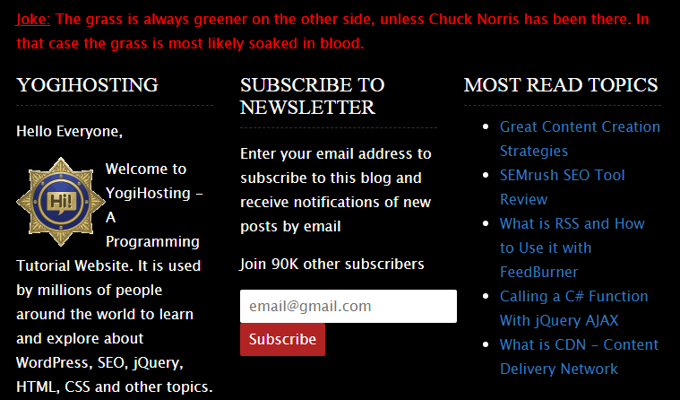

# Joke-API
Shows a Random Joke in a Web Page. Joke is fetched from Public API using JavaScript and jQuery

You can show a random joke to the user in your website by fetching the joke from a Public API. You can do this by making an AJAX request call to the API in JavaScript 

or jQuery. Just add a div element to your web page where you want the Joke to appear. 

The API URL is - https://api.icndb.com/jokes/random

# This is how the joke will appear in your web page


Add a div to your page:

```
<div class="joke"></div>
```

# JavaScript Code:
Now add the JavaScript code for making AJAX request:

```
<script>
const request = new XMLHttpRequest();
 
request.open('GET', 'https://api.icndb.com/jokes/random');
request.send(); 
 
request.onload = () => {
  if (request.status === 200) {
    console.log("Success"); 
    
    //Extracting data
    var joke = JSON.parse(request.response).value.joke;
    
    //Showing the joke in the table
    document.getElementById("joke").innerHTML = joke;   
  } 
};
 
request.onerror = () => {
  console.log("error")
}; 

</script>
```

# jQuery Code:
The [jQuery AJAX](https://www.yogihosting.com/jquery-ajax/) code form making the AJAX request is:

```
<script src="https://ajax.googleapis.com/ajax/libs/jquery/3.2.1/jquery.min.js"></script>
<script>
$(document).ready(function() {
    $.ajax({
        type: "GET",
        url: "https://api.icndb.com/jokes/random",
		dataType: "json",
        success: function (msg) {
            $("#joke").html(msg.value.joke);
        },
        error: function (req, status, error) {
            alert(req + " " + status + " " + error);
        }
    });
});
</script>
```

## Support

If you find it useful then support this Project. Thank you.

<a href="https://www.buymeacoffee.com/YogYogi" target="_blank"></a>


Have Fun!
